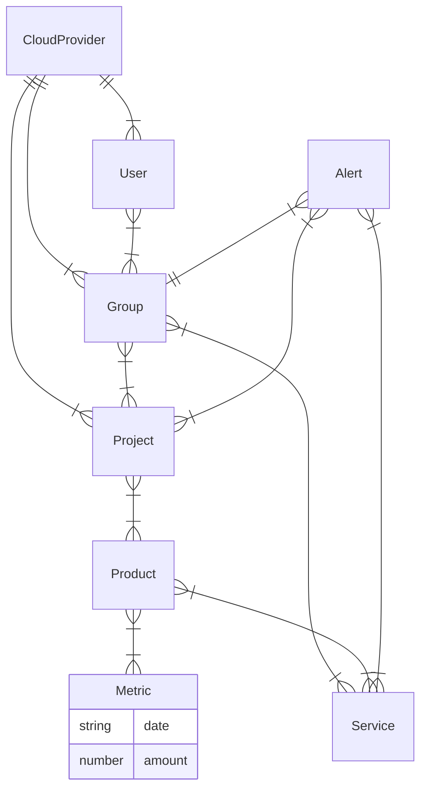
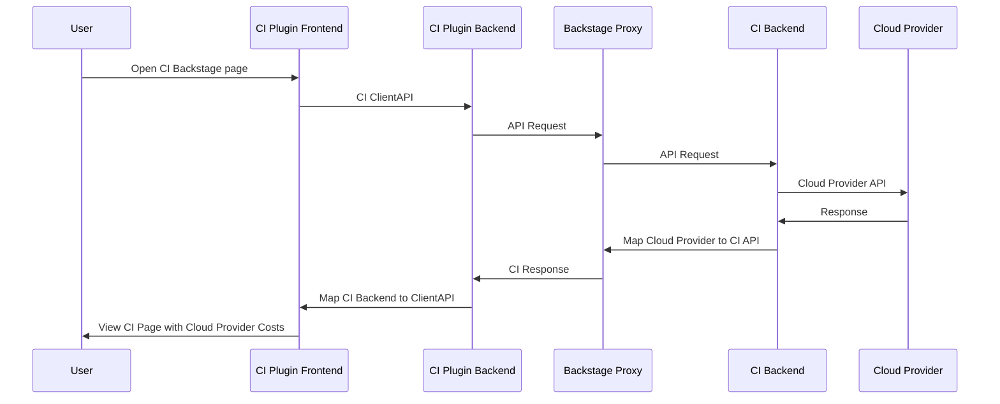

# Cost-Insights-Backend Docs

## Summary

We want to enable the 
[CostInsights plugin](https://backstage.io/blog/2020/10/22/cost-insights-plugin) built into the 
Backstage Dev Portal using this backend project. The CostIsnight plugin frontend does not have have
backend implementation. The CostInsights backend will use the Cloud Provider cost management APIs,
e.g. [AWS Billing and Cost Management API](https://docs.aws.amazon.com/aws-cost-anagement/latest/APIReference/API_GetCostAndUsage.html).

We will try to extend the CloudProvider tags/labels using Kubernetes labels
to extract cost information for each application team.

General flow of the implementation:
Progress to date:
* Implemented the [CostInsightsApi](https://github.com/backstage/backstage/blob/master/plugins/cost-insights/src/api/CostInsightsApi.ts) in the backend.
* as stubs that return static data and test with plugin
* Integrate CostInsights Backend using Backstage Plugin and Proxy so that APIs are native to Backstage. This should provide similar function to current CostInsights API Mock but talking to backend server.
* Integrate with [AWS Billing and Cost Management API](https://docs.aws.amazon.com/aws-cost-anagement/latest/APIReference/API_GetCostAndUsage.html) and test with backend plugin


## Data Model
The data model for CostInsights that will be supported by the backend is shown below, if we have
to relate this to the 
[CMDB data model](https://seizadi.github.io/cmdb/model/) you have to reference this table:

| CMDB        | CostInsights |
| :---------: | -----------: |
| Account	  | Project      |
| App	      | Service      |
| KubeCluster | Product      |

I have kept the terminology adopted by CostInsights since it is in line with Backsatge terminology.


## Data Flows
In the diagrams we will use CI acronym for CostInsights.



## AWS Cost Management API
I made a significant design decision that is trivial but has some signifcant ramifications.
```go
func getAwsMetricAmount(metric ceTypes.MetricValue) int32 {
	amount, _ := strconv.ParseFloat(*metric.Amount, 64)
	return int32(math.Round(amount))
}
```
AWS API return a float string and CostInsights API can accept a number which could be float or int.
I convert them to round integers. The fall out of this is that I end up with infrequently used services
having dropping out providing any cost for a day or the entire duration, where as AWS CostExplorer would
report a value, you will also see some small differences in totals of grouped values versus the Project(Account)
totals.

This filtering effect is desirable so we can focus on the CloudProvider Products that are driving the
over all cost.

The CostExplorer API will return only 12 months of data, the backend will return 400 error on duration
that does not meet this spec:
```bash
      "message": "operation error Cost Explorer: GetCostAndUsage, https response error StatusCode: 400, RequestID: 3925a325-d037-4f3c-bfd6-351a11b5c5e7, api error ValidationException: start date is too old for daily granularity, max months for data available is 12 months"
```

There is writeup of 
[Cost Insights integration with AWS in Backstage](https://github.com/backstage/backstage/blob/master/plugins/cost-insights/contrib/aws-cost-explorer-api.md)
 
The [AWS Go SDK doc here.](https://docs.aws.amazon.com/sdk-for-go/api/)

### AWS Cost Managment API Reference
* [Get Dimensions](https://docs.aws.amazon.com/aws-cost-management/latest/APIReference/API_GetDimensionValues.html)
* [Get Usage](https://docs.aws.amazon.com/aws-cost-management/latest/APIReference/API_GetCostAndUsage.html)
## Development
The project uses a Go microservice, this is a departure with Backstage that is developed using nodeJS
for the services. We will use the
[Backstage bacend plugin](https://backstage.io/docs/plugins/backend-plugin)
to implement the 
[CostInsights API](https://github.com/backstage/backstage/blob/master/plugins/cost-insights/src/api/CostInsightsApi.ts).
We will reference the
[CostInsights API template](https://github.com/backstage/backstage/blob/master/plugins/cost-insights/src/example/templates/CostInsightsClient.ts).
for our implementation.

## Cost Metrics
There are many different Cost Metrics returned by API.
Unblended costs represent your usage costs on the day they are charged to you. 
In finance terms, they represent your costs on a cash basis of accounting.

If you have a saving plan with AWS like
[AWS Reservation](https://aws.amazon.com/aws-cost-management/reserved-instance-reporting/)
and pay some amount, let's pick a large amount, then on cash basis you will have that 
applied on the first of the month on your bill, and the savings applied on the following days. 
This might not be ideal and not show the true cost of using your resources. 
Viewing your amortized costs is useful in this case in which it doesn’t make sense 
to view your costs on the day that they were charged. It’s useful to view costs on an 
accrual basis rather than a cash basis.

You can read about the other AWS Cost Methods
[here](https://aws.amazon.com/blogs/aws-cost-management/understanding-your-aws-cost-datasets-a-cheat-sheet/)
and more detail about
[AWS Billing](https://docs.aws.amazon.com/awsaccountbilling/latest/aboutv2/con-bill-blended-rates.html#Calculating)

So, which cost dataset should you use?
If you are a customer who has purchased Savings Plans or Reservations, 
then amortized costs are most likely the right dataset for analyzing your cost trends.
Otherwise, looking at unblended costs should suit you just fine.

Finally, if you are operating at scale or have highly specialized use cases, 
it may make sense to investigate using the net unblended, net amortized, or blended cost datasets.

We set net amortized cost as the default for now assuming if you are going to all the 
trouble to run CostInsights you are operating at scale.

```bash
yarn create-plugin --backend  --no-private cost-insights
```
## MkDocs References
* [How to get diagrams in MkDocs](https://chrieke.medium.com/the-best-mkdocs-plugins-and-customizations-fc820eb19759)
* [How to setup MkDocs on Mac and Github](https://suedbroecker.net/2021/01/25/how-to-install-mkdocs-on-mac-and-setup-the-integration-to-github-pages/)
* [Mermaid](https://mermaid-js.github.io/mermaid)
* [Mermaid2 plugin](https://github.com/fralau/mkdocs-mermaid2-plugin#declaring-the-superfences-extension)
* [Mermaid Live Editor](https://mermaid-js.github.io/mermaid-live-editor/#/edit/eyJjb2RlIjoiZ3JhcGggVERcbiAgICBBW0NocmlzdG1hc10gLS0-fEdldCBtb25leXwgQihHbyBzaG9wcGluZylcbiAgICBCIC0tPiBDe0xldCBtZSB0aGlua31cbiAgICBDIC0tPnxPbmV8IERbTGFwdG9wXVxuICAgIEMgLS0-fFR3b3wgRVtpUGhvbmVdXG4gICAgQyAtLT58VGhyZWV8IEZbZmE6ZmEtY2FyIENhcl0iLCJtZXJtYWlkIjp7InRoZW1lIjoiZGVmYXVsdCJ9LCJ1cGRhdGVFZGl0b3IiOmZhbHNlfQ)
* [Mermaid Diagram Syntax](https://mermaid-js.github.io/mermaid/#/flowchart?id=flowcharts-basic-syntax)
