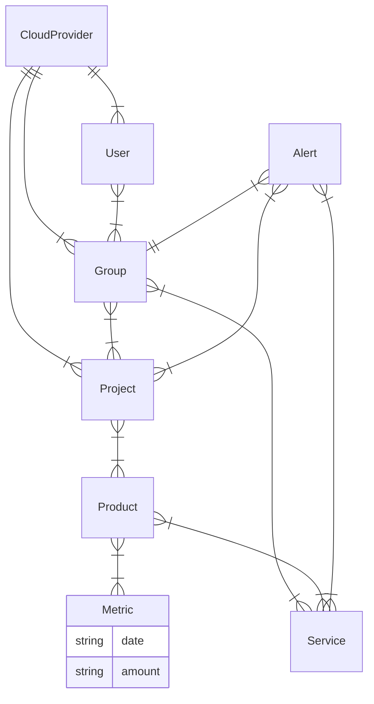
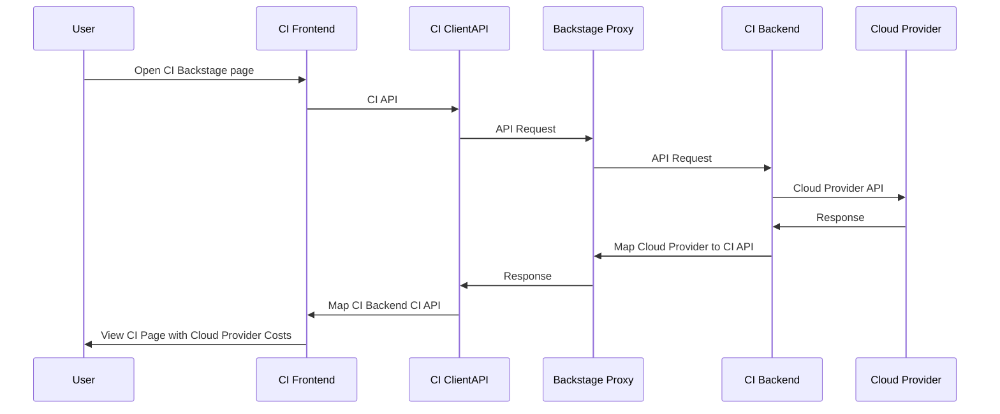

# Cost-Insight-Backend Docs

## Summary

We want to enable the 
[CostInsight plugin](https://backstage.io/blog/2020/10/22/cost-insights-plugin) built into the 
Backstage Dev Portal using this backend project. The CostIsnight plugin frontend does not have have
backend implementation. The CostInsight backend will use the Cloud Provider cost management APIs,
e.g. [AWS Billing and Cost Management API](https://docs.aws.amazon.com/aws-cost-anagement/latest/APIReference/API_GetCostAndUsage.html).

We will try to extend the CloudProvider tags/labels using Kubernetes labels
to extract cost information for each application team.

General flow of the implementation:

* Reference the [Cost Insight AWS Doc](https://github.com/backstage/backstage/blob/master/plugins/cost-insights/contrib/aws-cost-explorer-api.md)
  as a guide.
* Implement the [CostInsightApi](https://github.com/backstage/backstage/blob/master/plugins/cost-insights/src/api/CostInsightsApi.ts) as stubs that return static data and test with plugin
* Integrate CostInsight Backend using Backstage Plugin and Proxy so that APIs are native to Backstage. This should provide similar function to current CostInsight API Mock but talking to backend server.
* Integrate with [AWS Billing and Cost Management API](https://docs.aws.amazon.com/aws-cost-anagement/latest/APIReference/API_GetCostAndUsage.html) and test with backend plugin

## Data Model
The data model for CostInsight that will be supported by the backend is shown below, if we have
to relate this to the 
[CMDB data model](https://seizadi.github.io/cmdb/model/) you have to reference this table:

| CMDB        | CostInsight |
| :---------: | ----------: |
| Account	  | Project     |
| App	      | Service     |
| KubeCluster | Product     |

I have kept the terminology adopted by CostInsight since it is in line with Backsatge terminology.

## Data Flows
In the diagrams we will use CI acronym for CostInsight.

## MkDocs References
* [How to get diagrams in MkDocs](https://chrieke.medium.com/the-best-mkdocs-plugins-and-customizations-fc820eb19759)
* [How to setup MkDocs on Mac and Github](https://suedbroecker.net/2021/01/25/how-to-install-mkdocs-on-mac-and-setup-the-integration-to-github-pages/)
* [Mermaid](https://mermaid-js.github.io/mermaid)
* [Mermaid2 plugin](https://github.com/fralau/mkdocs-mermaid2-plugin#declaring-the-superfences-extension)
* [Mermaid Live Editor](https://mermaid-js.github.io/mermaid-live-editor/#/edit/eyJjb2RlIjoiZ3JhcGggVERcbiAgICBBW0NocmlzdG1hc10gLS0-fEdldCBtb25leXwgQihHbyBzaG9wcGluZylcbiAgICBCIC0tPiBDe0xldCBtZSB0aGlua31cbiAgICBDIC0tPnxPbmV8IERbTGFwdG9wXVxuICAgIEMgLS0-fFR3b3wgRVtpUGhvbmVdXG4gICAgQyAtLT58VGhyZWV8IEZbZmE6ZmEtY2FyIENhcl0iLCJtZXJtYWlkIjp7InRoZW1lIjoiZGVmYXVsdCJ9LCJ1cGRhdGVFZGl0b3IiOmZhbHNlfQ)
* [Mermaid Diagram Syntax](https://mermaid-js.github.io/mermaid/#/flowchart?id=flowcharts-basic-syntax)
